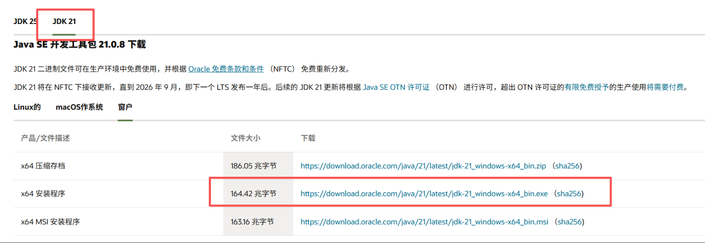
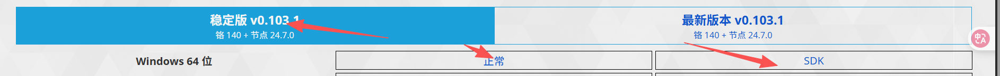

> [JAVA 开发pc端桌面软件 基于idea+nw.js+maven+springboot](https://www.cnblogs.com/tian98/p/15627467.html)

# 环境工具的准备

- [idea社区版安裝教程](https://jiyinhui.blog.csdn.net/article/details/143427455?spm=1001.2101.3001.6661.1&utm_medium=distribute.pc_relevant_t0.none-task-blog-2%7Edefault%7EYuanLiJiHua%7EPaidSort-1-143427455-blog-134727571.235%5Ev43%5Epc_blog_bottom_relevance_base2&depth_1-utm_source=distribute.pc_relevant_t0.none-task-blog-2%7Edefault%7EYuanLiJiHua%7EPaidSort-1-143427455-blog-134727571.235%5Ev43%5Epc_blog_bottom_relevance_base2&utm_relevant_index=1)

- [JDK版本](https://docs.oracle.com/en/java/javase/21/install/installation-jdk-microsoft-windows-platforms.html#GUID-371F38CC-248F-49EC-BB9C-C37FC89E52A0)

  

- [nw.js](https://nwjs.io/)
  
  下载SDK版本后解压到前端目录下
  > [nw.js 官方文档](hhttps://docs.nwjs.io/)
  
- node.js
> 1、校验安装是否完成
> node --version
>   V22.19.0
> npm --version
> 2、安装VUE脚手架
> npm install -g @vue/cli 
> 安装后使用 vue --version 命令查看版本号

# 项目结构

> 主要参考nw.js+springcloud的项目结构
>
> [idea社区版部署启动Spring MVC项目 idea社区版 springcloud_mob6454cc7c8b2e的技术博客_51CTO博客](https://blog.51cto.com/u_16099356/10986546)
>
> [十分钟轻松入门 nw.js 实现桌面应用程序-CSDN博客](https://blog.csdn.net/kaimo313/article/details/126405942)


```
assets:存储文档需要的图片
backend:后端
placeGameProject (根项目)
├── pom.xml (父项目配置)
├── eureka-server (服务注册中心模块)
│   ├── src/main/java
│   │   └── com/game/eureka
│   │       └── EurekaServerApplication.java (Eureka服务启动类)
│   └── src/main/resources
├── server-provider (服务提供者模块)
└── server-consumer (服务消费者模块)

启动方式：
# 1. 先编译整个项目（在根目录 placeGameProject 下）
mvn clean install

# 2. 启动 Eureka Server（进入 eureka-server 目录）
cd eureka-server
mvn spring-boot:run
启动后可访问：http://localhost:8761

# 3. 启动 Server Provider（在另一个终端窗口，进入 server-provider 目录）
cd server-provider
mvn spring-boot:run
启动后可访问：http://localhost:8081/hello

# 4. 启动 Server Consumer（在另一个终端窗口，进入 server-consumer 目录）
cd server-consumer
mvn spring-boot:run
启动后可访问：http://localhost:8082/hello

frontend:前端
placeGame (根项目)
├── build/scripts (前端脚本文件)
├── dist (build 完成后生成)
│   └── package.json (nw.js依赖文件)
├── node_modules (node.js依赖文件)
├── nwjs (nw.js SDK文件,nw上下载后解压到当前目录)
├── public (前端静态资源文件)
├── src (前端代码)
│   ├── assets (前端静态资源文件)
│   ├── components (前端组件)
│   ├── views (前端页面)
│   └── App.vue (前端页面)
├── index.html (前端入口文件)
├── package-lock.json (npm依赖文件)
├── vite.config.js (vite配置文件)
└── package.json (npm依赖文件)
启动方式：在placeFrontend目录下执行 npm run build 生成dist文件，后执行npm run start

```